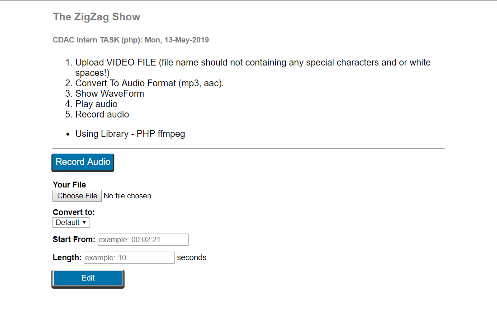

#The ZigZag Show    
Hello, 
Why This Name? Well it is related with waveforms of audio files.

##About Project
This Project basically takes video file and convert it to audio format (mp3, aac, wav).

This also converts the input wav file into mp3.

I kept it simple to understand the working process.

#####INPUT
* Any Video Format
* WAV Format
* Recorded Audio

#####OUTPUT
* AUDIO FORMAT
* Waveform Image
* Download Option
* Play Option

#####Libraries Used
* PHP ffmpeg
* Record RTC

